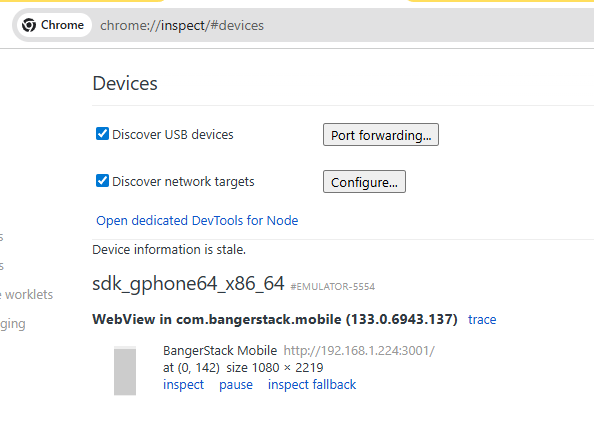

# BangerStack Mobile

Capacitor wraps a **Next.js** app so it runs inside an **Android WebView** (and can be extended to iOS). In development, the WebView loads the local dev server for live reload; in production it serves the static export from `out/`.

## Prerequisites

- **Node** (matching the monorepo) and **Bun** for installs at the repository root
- **Android Studio** with an SDK, platform tools (`adb` on your `PATH`), and a virtual device (AVD) or a physical device with USB debugging
- **Environment files** for this app (see your team’s secrets process). Scripts expect **dotenvx** and files such as `.env.local.development` / `.env.production` in this directory

From the monorepo root:

```bash
bun install
```

## Stack overview

| Piece | Role |
|--------|------|
| **Next.js** | App UI and routing (`app/`, etc.) |
| **Capacitor** | Native shell, WebView, `capacitor.config.ts` |
| **Port `3001`** | Dev server URL used by the WebView in live reload |
| **`libs/dev-server-origin.ts`** | Builds `server.url` for Capacitor (LAN IP, `10.0.2.2`, or `127.0.0.1` depending on mode) |

Dev server **must** bind to all interfaces so the emulator/device can reach it:

```text
next dev --port 3001 -H 0.0.0.0 --webpack
```

Webpack is used in dev so HMR works reliably in the WebView (see comments in `libs/dev-server-origin.ts`).

## Scripts

All commands below are run from **`apps/mobile`** unless noted.

| Script | Purpose |
|--------|---------|
| `bun run dev` | Full mobile dev stack: emails build, UI watch, env check, **Next on :3001** |
| `bun run dev:web` | Next dev only (`:3001`, `0.0.0.0`, webpack) with `.env.local.development` |
| `bun run dev:android` | **`cap run android`** with live reload to port **3001** (requires dev server reachable at that URL) |
| `bun run build` | Production Next build + `postbuild` runs `cap copy` |
| `bun run cap:sync` / `cap:copy` | Sync web assets into native projects |

From the **repo root**, you can also use:

```bash
bun run dev:mobile          # turbo: mobile dev (emails + UI + Next)
bun run dev:mobile:android   # cd apps/mobile && bun run dev:android
```

### Typical Android emulator workflow

1. Start **one** terminal and run **`bun run dev`** (or at least `bun run dev:web`) so Next is on **`http://<your-lan-ip>:3001`** (or the host your `capacitor.config` points to).
2. Run **`bun run dev:android`** in another terminal (or use Android Studio to run the app after sync).
3. If the WebView cannot load the site, check firewall/VPN, set **`CAP_DEV_LAN_HOST`** to your PC’s LAN IPv4, or switch **`EMULATOR_DEV_URL_MODE`** in `libs/dev-server-origin.ts` (`lan` | `adb-reverse` | `host-alias`) and re-run `cap copy` / sync as needed.

Capacitor live reload docs: [Live reload](https://capacitorjs.com/docs/guides/live-reload).

## Production / static hosting

- **`bun run build`** produces the Next output and copies it into native projects.
- **`bun run start`** / **`start:prod`** serve the **`out/`** folder locally on port **3001** (useful for smoke tests).

## Lint and types

```bash
bun run lint
bun run check-types
```

---

## Debugging the Android WebView (Chrome DevTools)

You debug the **WebView** from **Google Chrome on your computer**, not by adding your Next port to “network target discovery” in `chrome://inspect`.

### Steps

1. **USB debugging** (emulator usually has this on; physical devices: Developer options).
2. Ensure **`adb devices`** shows your emulator (e.g. `emulator-5554 device`).
3. **Launch the app** on the emulator and keep it **in the foreground** so the WebView is active.
4. On the PC, open Chrome and go to **`chrome://inspect/#devices`**.
5. Enable **Discover USB devices**. You do **not** need to list `*:3001` under **Configure…** for network targets—that dialog is for Chrome’s remote-debugging protocol (e.g. port **9222**), not your HTTP dev server.
6. Under your device, find **WebView in com.bangerstack.mobile** (package name may match your `appId` in `capacitor.config.ts`).
7. Click **`inspect`** to open DevTools (Elements, Console, Network, etc.) for that WebView.

If you see **“Device information is stale”**, restart ADB and Chrome:

```bash
adb kill-server
adb start-server
adb devices
```

Then reload **`chrome://inspect/#devices`**. Use a single consistent **`adb`** on your `PATH` (same as Android SDK **platform-tools**).

### Screenshot reference

When it works, **Devices** lists the emulator and the WebView with the dev URL (for example your LAN IP on port **3001**). Example:



---

## Project layout (short)

| Path | Purpose |
|------|---------|
| `app/` | Next.js App Router |
| `android/` | Capacitor Android project |
| `capacitor.config.ts` | Capacitor app id, `server.url` in dev, cleartext |
| `libs/dev-server-origin.ts` | Dev origin / port / emulator URL mode |

## Further reading

- [Capacitor Android documentation](https://capacitorjs.com/docs/android)
- [Next.js static export / deployment](https://nextjs.org/docs/app/building-your-application/deploying/static-exports) (if applicable to your `next.config`)
